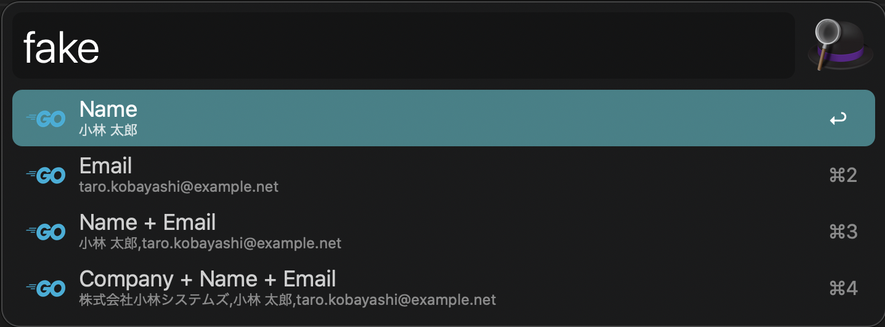

# Fake Generator([Download v1.0](https://github.com/walkersumida/alfredworkflow-fake-generator/releases/download/v1.0/FakeGenerator.alfredworkflow))




# Compile

```sh
go build
```

# Run
```
./main
```